# Pandas Customer Call List Data Cleaning
In this project we use pandas to clean a customer call list. 

## Quick Links
- Raw customer call list dataset: [Raw Customer Call List](customer_call_list.xlsx)
- Cleaned customer call list dataset: [Cleaned Customer Call List](cleaned_customer_call_list.xlsx)
- Jupyter Notebook of the cleaning process: [Jupyter Notebook](customer_call_list_data_cleaning_project.ipynb)
- Other projects I have made: [Portfolio Website](https://lucashoffschmidt.github.io/)

## Technologies Used
- **Jupyter Notebook**: Web-based interactive computing environment. 
- **Pandas**: Data cleaning.

## Process
- Created a new Jupyter Notebook, imported pandas and loaded the customer call list dataset into a dataframe
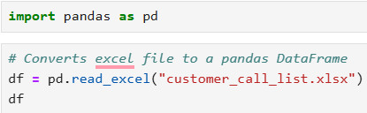

- Removed duplicate rows
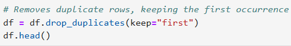

- Removed redundant columns

- Removed irrelevant characters from last name values
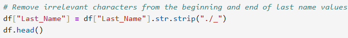

- Standardized phone numbers
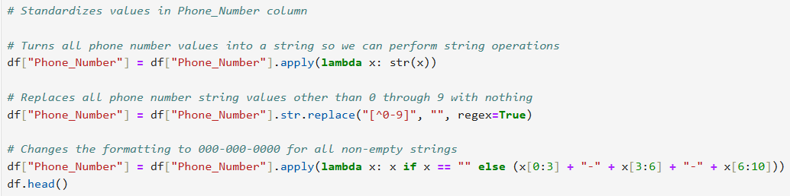

- Standardized Paying Customer and Do_Not_Contact columns
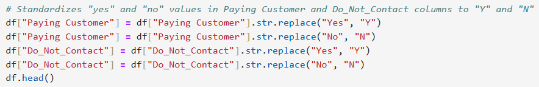

- Split the address column into its constituent elements
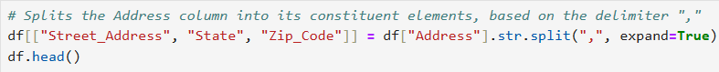

- Replaced not available and NaN values with empty strings
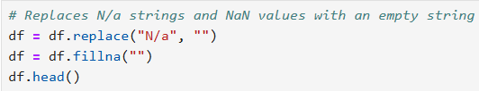

- Removed customers that may not want to be contacted
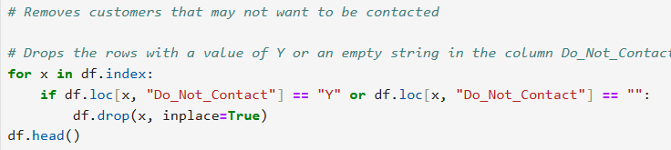

- Removed customer that cannot be contacted
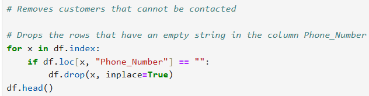

- Dropped columns that only contained empty strings
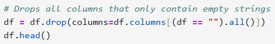

- Reset the index
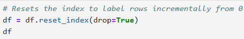

- Saved cleaned dataframe to an excel file
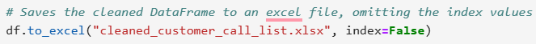

## Raw Customer Call List
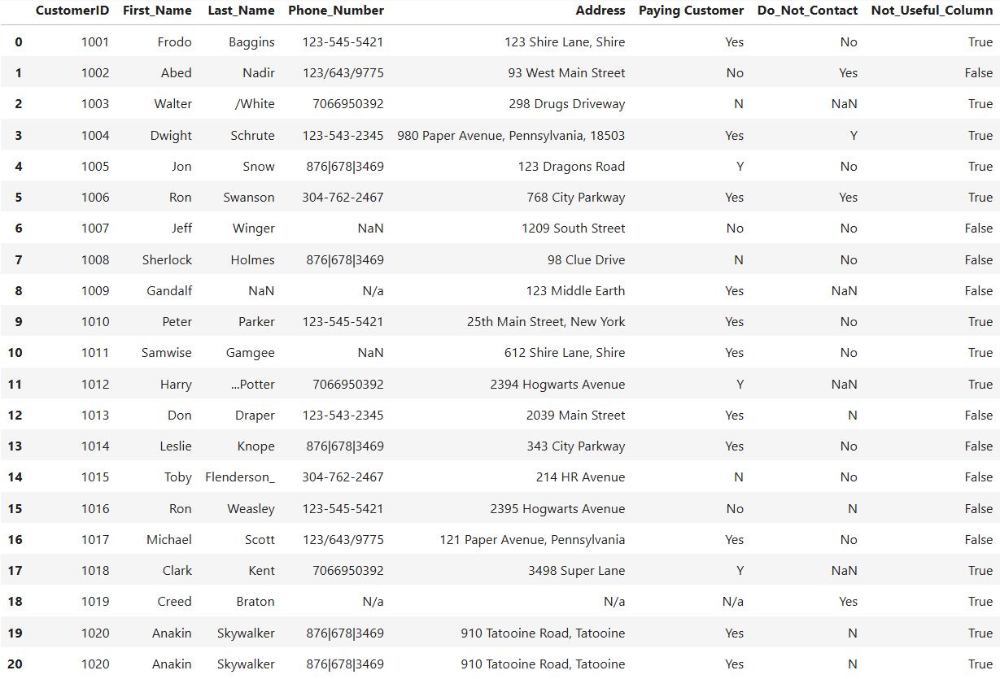

## Cleaned Customer Call List

