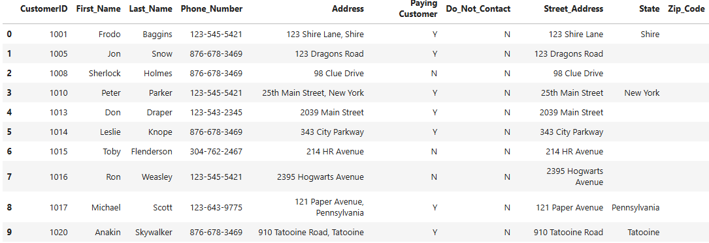

# Python Pandas Customer Call List Data Cleaning
In this project we clean a customer call list using the python library of pandas.

## Tools and technologies
- **Jupyter Notebook**
- **Python**: Data cleaning
  - Pandas 

## Project Objectives
- Clean the data to only show customers that are available to be called

## Data Sources
- [Customer Call List](customer_call_list.xlsx)

## Analysis steps
- **Data Cleaning**:
  - Import pandas
  - Transformed the customer call list to a dataframe
  - Removed duplicates
  - Removed irrelevant columns
  - Removed irrelevant characters from the beginning and end of last name values
  - Standardized all phone number values to the same format
  - Standardized values in the columns Paying Customer and Do_Not_Contact
  - Split the address column into distinct columns based on the comma delimiter
  - Replaced not available values with empty strings
  - Removed irrelevant rows 
  - Reset the index to show numbers incrementally from 0

## Visualizations
**Cleaned Customer Call List**

